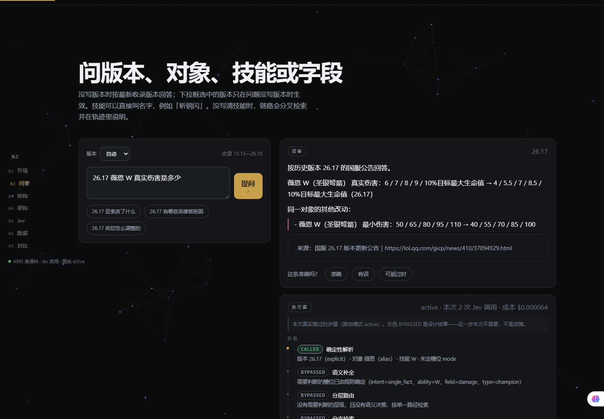
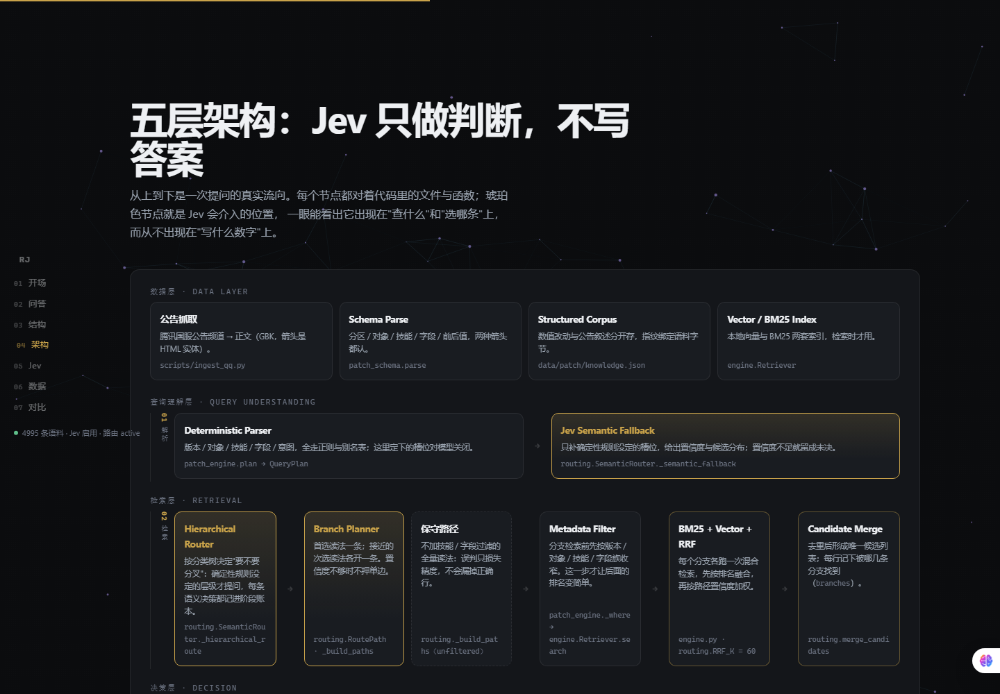
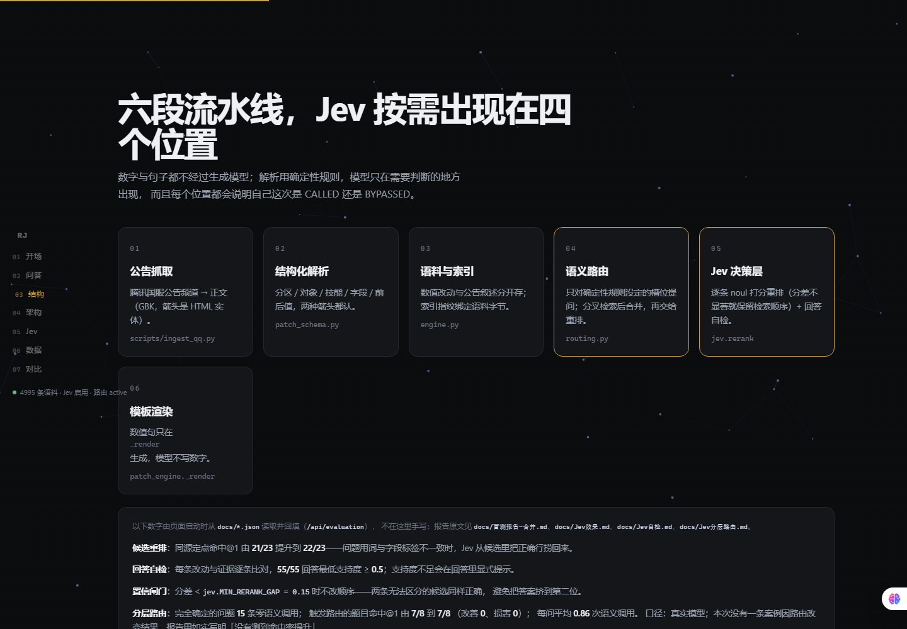
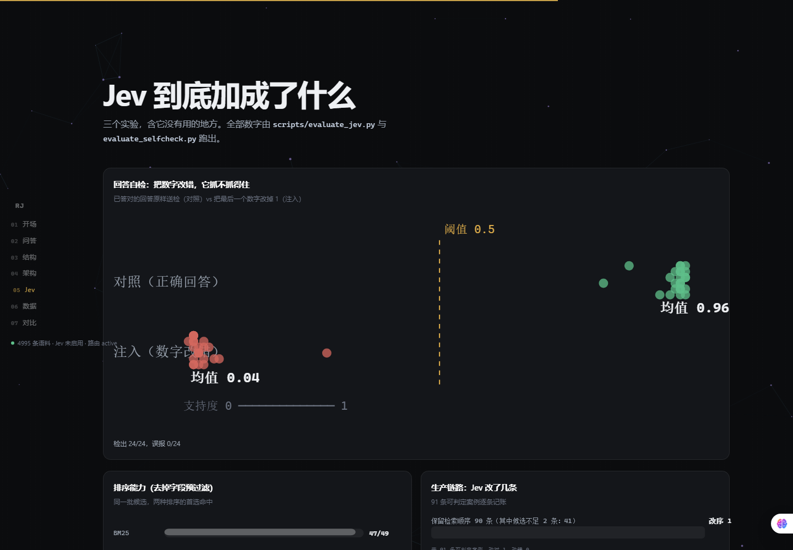
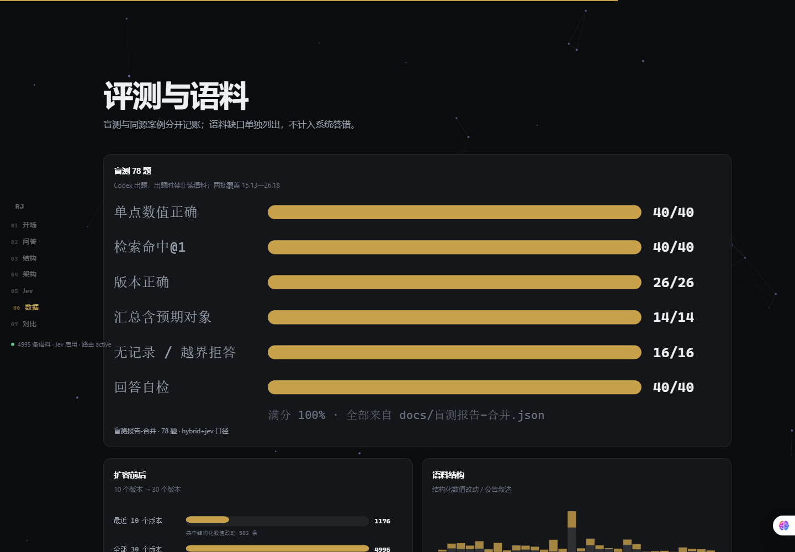

# RAG Jev

**English** · [简体中文](README.md)

A local RAG question-answering system over the Chinese League of Legends patch notes, plus a **Jev (TypeSafe System One) decision layer**.

[](https://github.com/Nixz0824/rag-jev/actions/workflows/ci.yml)


Every number in an answer is copied from a structured extraction of the official announcement — **no generative model writes values**.

> **Deterministic where possible. Semantic decisions where necessary.**

That is not a slogan; it is pipeline behaviour that tests and evaluations can check. For a question like
`26.17 薇恩 W 真实伤害是多少`, the patch, the subject, the ability and the field are all fixed by regexes
and the alias table, so the **number of semantic calls is zero**; only a phrasing the rules did not
understand ("that ability's damage") brings a model in — and for every step a model takes, the page shows
what it cost and whether its answer was used.

---

## Jev's four positions in the RAG lifecycle

```text
Query Understanding    rule parsing → semantic fallback (only slots the rules did not resolve are asked about)
        ↓
Retrieval Planning     hierarchical routing: which part of the knowledge space to search (fork into 2 branches when unsure)
        ↓
Candidate Selection    candidate rerank: which of the already-retrieved candidates to pick
        ↓
Answer Verification    evidence judging: whether the rendered claim is supported by evidence
```

The four roles correspond to `routing.SemanticRouter._semantic_fallback`,
`routing.SemanticRouter._hierarchical_route`, `jev.rerank` and `jev.judge_many`;
each role leaves one of four states in the session — `called` / `bypassed` / `fallback` / `failed` —
and **"skipped" is also a result that has to state its reason**, not a blank.

---

## Why this is not just another RAG demo

| Dimension | Typical RAG demo | This project |
|---|---|---|
| Where numbers come from | The model writes them | Template rendering, values come from announcement chunks only (`_render`) |
| Where the model sits | The whole pipeline goes to an LLM | **Only where a judgement is needed**: every stage outside the four roles is deterministic code |
| Version handling | Pure similarity search | **Metadata filtering before ranking**; three numbering schemes (`26.17` / `16.17` / `15.13`) normalised automatically |
| Is the model wasted | Called for every question | A fully-determined question costs **0 calls** (pinned by a test); **0.86** semantic calls per question on average |
| What happens when it is unsure | Pick one and narrow down | When the top and the runner-up are close, **keep two search branches** and one extra unfiltered conservative path |
| Can it be switched off / compared | No | `RAGJEV_ROUTING_MODE` = `off` / `shadow` / `active`, so a controlled comparison can be run |
| Evaluation | None, or a few self-authored questions | **78 independent blind questions** (the authoring model was forbidden from reading the corpus) + 48 parsing blind cases + 18 trap cases + 8 routing cases |
| Negative results | Not mentioned | Three ranking arms tie after filtering; measured gate thresholds were **not** adopted; reranking has very little room; the routing benefit has too small a sample — all kept in the reports |
| Engineering | A notebook | 193 unit tests + GitHub Actions + Windows Job Object process supervision + index fingerprinting + announcement text never committed |

---

## Interface

A local single-page workbench (`web/`) with a vertical index on the left: Intro / Ask / Structure / Architecture / Jev / Data / Compare.

**Ask** — numbers come straight from announcement entries; the right panel shows the **execution graph for this
query** (which stage actually ran, which stages were skipped and why), the evidence list and the Jev decision panel.



**Architecture** — a static diagram that walks the whole pipeline in five layers (data / query understanding /
retrieval / decision / answer safety). Every node names the file and function it corresponds to, and every Jev node
is marked in amber gold, so "Jev decides *what to look for* and *which row to pick*, and never writes an answer
number" is visible rather than merely claimed.



**Six-stage pipeline** — from announcement fetching to template rendering, with Jev appearing in four of the roles.



**What Jev actually contributes** — four experiments as charts (self-check injection dot plot, ranking comparison, production-path accounting).



**Evaluation and corpus** — blind-test scores, corpus growth, per-patch corpus shape; the table and the "net contribution" list are read from `docs/*.json`.



Shareable links work too: `/?q=26.17 薇恩 W 真实伤害是多少` asks on load, `/?view=jev` jumps to a section.

---

## 1. Corpus scale

Generated by `python scripts/corpus_stats.py`; the full table is in [docs/语料统计.md](docs/语料统计.md).

| Metric | Recent 10 patches (26.9—26.18) | All 30 patches (15.13—26.18) | Growth |
|---|---|---|---|
| Patches | 10 | **30** | ×3.0 |
| Chunks | 1176 | **4995** | ×4.25 |
| Structured numeric changes | 503 | **2212** | ×4.40 |
| Narrative paragraphs | 673 | 2783 | ×4.14 |
| Champions (unique) | 96 | **170** | ×1.77 |
| Items (unique) | 29 | **85** | ×2.93 |
| Changes with ability attribution | 265 | **1008** | ×3.80 |

Parsing quality: 44.3% of chunks are structured changes, and the field normalisation rate is 91.0%
(rows that do not normalise keep their raw label and are simply not reachable by field filters).

The taxonomy is not copied from another project; it is built from the real distribution of this corpus:
`type` is champion 2233 / system 1363 / mode 968 / item 431; `ability` is empty for 3987 rows —
**the vast majority of change rows belong to no ability at all**, which makes "ability unknown" the slot
most worth completing semantically; `damage` accounts for 33% of structured rows in `field_key`,
so the field level is built as two tiers ("family → concrete key") to keep one big class from
swamping the rest.

---

## 2. Evaluation (four scopes, accounted separately)

Everything is produced by `scripts/evaluate_*.py`; the page and the reports only read `docs/*.json`.

### Hierarchical routing — 40-case effect set (`--cases tests/cases/routing_effect_cases.json`)

This set was **built specifically to measure a routing gain**: an independent author wrote it from the
official announcements (forbidden from reading this corpus), every case describes a skill's purpose
without naming it while only one reading is defensible in the corpus, and the subject has several
changed rows in that patch — so **the correct row is pushed down when nothing narrows the skill**.
The 8-case set below lacks that property, which is why it cannot show a gain; this one can.

Real model, 3 repeats, in both retrieval scopes (hybrid is the production default):

| Retrieval | off | shadow | **active** | only active solved | only off solved | hit@5 |
|---|---|---|---|---|---|---|
| BM25 | 25/40 | 25/40 | **28.3/40** | 4 | 0 | 40/40 |
| **hybrid (default)** | 26/40 | 26/40 | **30/40** | 4 | 0 | 40/40 |

- **Both scopes agree in direction**: under hybrid, off is exactly `26` and active exactly `30` in all
  three rounds; under BM25, off is `25` and active `28/28/29`.
- **Routing produces a measurable gain and harms no previously-correct answer** — "only off solved" is
  0 in both scopes.
- **The gain is small**: net **+3–4 of 40** (about +8–10%), concentrated in 5 cases. Forty cases cannot
  support a general percentage claim.
- **hit@5 is 40/40 in both scopes**: the correct row was always retrievable, so routing improves
  **ranking**, not recall.
- **12 cases fail in both scopes.** Attribution (`scripts/attribute_routing_errors.py`, mean of 3 repeats):
  **8.7 are "right skill, wrong row"** (a reranking residual that better routing cannot fix),
  2.3 misread the skill, 1.0 got no usable signal. **Most of that 30% is not the routing layer's fault.**
- **`shadow` matches `off` exactly**: shadow performed all 210 decisions and simply did not use them.
- Reports: [BM25](docs/Jev分层路由-效果集.md), [hybrid](docs/Jev分层路由-效果集-hybrid.md),
  [attribution](docs/Jev分层路由-失败归因.md).

**Which axis this set covers (important)**: all 40 cases exercise **skill disambiguation** only —
the skill slot is open in 39/40, while the **field slot is closed by deterministic rules in 40/40**
(the questions contain canonical words such as "damage" or "mana cost"). The field-family routing axis
is therefore **not covered** and was not measured this release.

### Hierarchical routing mechanism set, 8 cases (default case file)

This set exists to pin **pipeline behaviour** (who gets asked, when it forks, when it skips), not to
measure a gain.

| Scope | hit@1 | hit@5 | Semantic calls |
|---|---|---|---|
| off | 7/8 | 8/8 | 0 |
| shadow | 7/8 | 8/8 | 18 over 3 rounds |
| **active** | **7/8** | 8/8 | 18 over 3 rounds |

- off and active are both 7/8 here: 5 cases never need a model, 2 are solved anyway, and `r05`
  (Cassiopeia "skill damage", which matches Q/E/R/base rows) is undecidable from the corpus.
- **This cannot be used to argue routing is useless** — the set has no headroom by construction.
  Use the 40-case effect set to measure a gain.
- The earlier fixture-replay `off 5/8 → active 8/8` **did not reproduce with the real model** and is no
  longer cited. [docs/Jev分层路由.md](docs/Jev分层路由.md) states what was and was not proven.

### Blind set, 78 questions (authored by Codex from the official announcements, forbidden from reading the corpus)

Two batches cover different patch ranges: 38 questions over 26.9—26.18, and 40 questions over 15.13—26.8 including cross-patch aggregation.

| Metric | Result |
|---|---|
| Single-target numeric answers correct | **40/40** |
| Retrieval hit@1 / @5 | **40/40 · 40/40** |
| Version correct (26 questions that name a version) | **26/26** |
| Overview answers containing an expected subject | **14/14** |
| Cross-patch aggregation timeline coverage | **6/6** |
| Refusals (no record / out of scope) | **16/16** |
| Jev answer self-check (support ≥ 0.5) | **40/40** |

**Two corpus gaps** are accounted for separately (they are not counted as system errors):

- Gwen base armor in 15.16: the CN announcement does not contain this change (the English one does) — a genuine difference between the two announcements;
- Shyvana's large update in 26.6: rework sections describe a new kit in prose rather than `old ⇒ new`, so structured parsing deliberately skips them.

### Same-source set, 84 cases (authored against the corpus, **not blind**, used for regression)

| Metric | bm25 | vector | hybrid | hybrid + Jev |
|---|---|---|---|---|
| Single-target hit@1 (28) | 25 | 25 | 26 | 26 |
| Pinned hit@1 (23, ambiguous candidates) | 21 | 22 | 21 | **22** |
| Overview with expected subject (4) | 4 | 4 | 4 | 4 |
| Cross-patch aggregation (4, multi-hop) | 4 | 4 | 4 | 4 |
| Refusals (7) | 7 | 7 | 7 | 7 |
| Trap cases (18, rule-defined) | 18 | 18 | 18 | 18 |
| Answer self-check | — | — | — | **55/55** |
| Jev cost | — | — | — | $0.0031 / 37 calls |

### Query-understanding blind set, 48 cases (expectations describe the parse only)

**48/48**: subject 37/37, version 10/10, ability 14/14, field 19/19, mode 3/3, intent and guards 9/9.

---

## 3. What Jev actually contributes (four reproducible experiments)

This is not "we plugged in a model so it got better". Each of Jev's jobs is measured on its own — including the places where it **does not** help.

### Experiment 1 · **Before** retrieval: does hierarchical routing help?

It first measured **no gain**, and then, on a set built to measure one, it did. Worth recording:

| Stage | Case set | off | active | Verdict |
|---|---|---|---|---|
| First | 8-case mechanism set (mine) | 7/8 | 7/8 | no difference measurable |
| Second | 40-case effect set (written independently from the announcements) | 25/40 | **28.3/40** | gain, no harm |
| Second (production scope) | same, hybrid retrieval | 26/40 | **30/40** | larger gain, still no harm |

**Why the first attempt failed**: 5 of its 8 cases never need a model, 2 are solved anyway, and 1 is
undecidable — there was no headroom by construction. Routing can only show a difference when **the
subject has enough changed rows that the correct one is pushed down**, *and* the question is uniquely
but vaguely phrased. The old set satisfied that in **0 of 8** cases.

**The second result**: off 25/40 → active 28.3/40 under BM25, and 26/40 → 30/40 under the production
hybrid scope (every round exactly `26` and `30`); 4 cases solved only with routing, **0 solved only
without it**. Cost: **1.75** semantic calls and about 0.9 s per question.

**Limits that stand alongside that**: hit@5 is 40/40 in both scopes (ranking, not recall); 12 cases fail
either way and **8.7 of them are "right skill, wrong row"**, i.e. reranking residuals; and 40 cases
cannot support a general percentage claim.

### Experiment 2 · Ordering ability: same candidates, no field pre-filter

In production, metadata filtering first squeezes the candidates down to 1–6 rows, which leaves Jev almost
nothing to choose between. So this control is run on purpose: the candidate set is "every change row of that
subject in that patch" (≥2 rows required, 49 cases), and both orderings pick a top-1 from the *same* candidates.

| Ordering | Top-1 correct |
|---|---|
| BM25 (after metadata filtering) | 47/49 |
| **Jev rerank (same candidates)** | **48/49** |

Jev is uniquely right on 1 case, BM25 on 0. Command: `python scripts/evaluate_jev.py --ranker`

### Experiment 3 · Answer self-check: inject a wrong number and see if it fires

A correct answer is sent to the self-check unchanged (control), then the **last number in the rendered line is changed by one** (injected):

| Group | Support (mean) | Flagged as unsupported |
|---|---|---|
| Control (correct answers) | **0.96** | 0/24 (no false alarms) |
| Injected (wrong number) | **0.04** | **24/24 (all detected)** |

The two calls together cost $0.00045. Command: `python scripts/evaluate_selfcheck.py`

### Experiment 4 · Production path, case by case: how many rows did Jev actually change?

91 judgeable cases (both blind batches + same-source pinned cases):

| Situation | Cases |
|---|---|
| Fewer than 2 candidates after filtering — Jev has no room | 41 |
| Jev changed the order | **1** (1 right, 0 wrong) |
| Jev kept the retrieval order | 90 (87 were already right, 3 already wrong) |

Command: `python scripts/evaluate_jev.py` — report: [docs/Jev效果.md](docs/Jev效果.md)

### Conclusion

- **What it buys**: it recovers the correct row when candidates are ambiguous or the wording does not match the
  field label (same-source pinned hit@1 **21/23 → 22/23**); hierarchical routing lifts hit@1 from 26/40 to
  **30/40** on the 40-case effect set under the production scope (4 cases solved only with routing, 0 only
  without it); the answer self-check is the only component that can judge whether "these numbers are supported
  by this evidence" (24/24 detected, 0 false alarms, and **40/40** on the 78-question blind set).
- **What it does not**: metadata filtering already makes retrieval easy, so reranking has very little room
  (1 of 91 cases); the parsing layer does not need a model at all; the routing gain is concentrated in 5 cases and
  **does not improve recall** (hit@5 is 40/40 either way).
- **Cost**: about $0.0001 per rerank call; the 78 blind questions cost 16 calls / $0.00225 and the 84 same-source
  cases 37 calls / $0.00362; hierarchical routing makes 1.75 calls and about 0.9 s per question, 0 for a
  fully-determined one.
- **Degradation**: without a key every model stage is skipped automatically and marked in the trace and the
  phase ledger, and the pipeline keeps working.

## Problems the blind set found (all fixed)

| # | Problem | How it surfaced | Fix |
|---|---|---|---|
| 1 | Direction only compared the first number: `30-60% → 30-50%` was classified as "adjusted" instead of a nerf | Blind aggregation question about Riven's nerf history | Compare every number and fall back to the sum; the `adjust` bucket dropped from ~700 rows to 81 |
| 2 | A hyphen inside a range was read as a minus sign: `30-60%` parsed as `[30, -60]` | Same question | Lookbehind in the number regex |
| 3 | Ability attribution was lost when the ability sat inside the field name (`R 被动过载涌动伤害`) | Blind question about Ryze's R | Extract Q/W/E/R from the field-name prefix during ingestion |
| 4 | A short alias outranked the subject: "瑞兹 R 被动过载涌动伤害" resolved to the *item* 过载 | Same question | Alias matching now prefers longest, then earliest position, then champions over items |
| 5 | Missing player nicknames (船长/鸟皇/熊/猴子/诺手/铁男/冰女 …) | Blind questions "船长 Q 蓝耗", "鸟皇基础生命值" | Nickname table grown to 100+ champion nicknames and 74 item rules (including English shorthands such as IE/BT/QSS/PD) |

---

## Quick start

```powershell
# 1. Dependencies: Python 3.12+ and numpy
python -m pip install numpy

# 2. Models (~1.7 GB, verified by SHA-256)
python scripts/download_runtime.py
python scripts/download_models.py

# 3. Corpus (needs network: Data Dragon + the CN announcement site)
python scripts/build_aliases.py
python scripts/ingest_qq.py --count 30 --pages 90   # use --count 10 for a quick run

# 4. Start (builds the vector index on first run)
python launch.py
# open http://127.0.0.1:18890
```

Stop with `python launch.py --stop`, or run `停止服务.cmd`.

### Jev (optional)

```powershell
$env:TYPESAFE_API_KEY = "sk-..."        # or write it into runtime/jev-key.txt
$env:RAGJEV_ROUTING_MODE = "active"     # off / shadow / active, active by default
```

Without a key the system still works: deterministic parsing, metadata filtering, hybrid retrieval and template
rendering are all available, while semantic fallback / hierarchical routing / rerank / self-check are skipped —
**and every skip is written into the trace and the phase ledger**
(`/api/health` shows `jev.enabled=false` and the current `routing_mode`).

### Three routing modes

| Mode | Behaviour | Use |
|---|---|---|
| `off` | Deterministic parsing only, no model is called for understanding | Reproduces the 0.13.0 baseline |
| `shadow` | Semantics are decided and recorded as usual, but **do not affect retrieval** | Compare against active: same call count, so the difference only comes from *using* the routing |
| `active` | Branches really take part in retrieval and merging | Production default |

---

## What you can ask

| Question | Behaviour |
|---|---|
| `26.17 亚索改了什么` | Every structured change for that champion in that patch |
| `16.17 岚切怎么调整的` | Data Dragon version numbers are mapped onto announcement numbers (26.17) automatically |
| `15.13 希瓦娜 W 冷却` | Both 2025 numbering schemes (15.x and 25.x) resolve to the right patch |
| `26.17 薇恩 W 真实伤害是多少` | Field rules + aliases + explicit ability, **0 semantic calls** |
| `卡西奥佩娅那个技能伤害之前改过吗` | The ability is not spelled out: one semantic decision, and when the top and runner-up are close it **opens two branches** for retrieval |
| `26.17 有哪些英雄被削弱` | Change list for that patch (Summoner's Rift by default) |
| `赛娜从 26.13 到 26.18 一共改了几次` | **Cross-patch aggregation**: per-patch timeline, direction counts, most-adjusted fields |
| `沃利贝尔历次被削弱的记录` | No version range given → aggregates over all covered patches, narrowable by direction |
| `娜美 E 每次伤害改成多少了` | No version given and the latest patch has nothing → falls back to the **most recent change** and labels it as a historical patch |
| `26.15 锐雯的放逐之锋怎么改了` | **Ask by ability name** (865 ability names mapped to Q/W/E/R/passive) |
| `电刀现在多少钱` / `IE 多少钱` | **Item nicknames and English shorthands** (电刀 = Statikk Shiv, IE = Infinity Edge) |
| `卢登的配枪改了什么` / `C44 改了什么` | **Historical names and internal codenames** found in announcements also resolve |
| `26.17 亚索为什么被调整` | Appends the design intent from the announcement (narrative corpus) |
| `26.16 迦娜这版改了什么` | When only prose exists and no numeric entry, it says so instead of presenting prose as a change |
| `26.6 希瓦娜重做了什么` | Reworks and large updates are prose; the system states that they are not covered |
| `26.18 阿卡丽改了什么` | When the patch has no record, it points at the patches that do |

---

## Commands

```powershell
python -m unittest discover -s tests          # 175 tests, no models or network needed
python scripts/ingest_qq.py --offline         # rebuild the corpus from cached announcements
python scripts/corpus_stats.py                # corpus tables (docs/语料统计.md)
python scripts/build_aliases.py --offline     # rebuild champion/item aliases
python scripts/evaluate_parse.py              # query-understanding blind set (no models)
python scripts/evaluate_routing.py            # off/shadow/active hierarchical routing comparison
python scripts/evaluate_routing.py --cases tests/cases/routing_effect_cases.json --repeat 3
                                              # 40-case effect set; add --retrieval hybrid for production
python scripts/attribute_routing_errors.py    # attribute failures: wrong skill, or wrong row
python scripts/evaluate_patch.py              # four-arm A/B (models running; Jev needs a key)
python scripts/evaluate_jev.py                # Jev case-by-case accounting (--ranker measures ordering)
python scripts/evaluate_selfcheck.py          # self-check injection detection rate
python scripts/calibrate.py --report          # gate measurement (conclusion: not adopted)
python scripts/ingest_en.py --offline         # cross-check against the English announcements
python scripts/review_feedback.py             # review page feedback → docs/反馈复核.md
python tools/screenshot.py                    # capture UI screenshots via CDP (Edge + running server)
python tools/check_viewport.py                # narrow screens: page overflow / bottom-bar occlusion / JS errors
python tools/check_viewport.py --width 390    # pin a viewport width and sweep the breakpoints
# Blind sets (author new questions with docs/盲测集提示词.md and 提示词-第二批.md):
python scripts/evaluate_patch.py --cases tests\cases\blind_cases.json --out docs\盲测报告-第一批.md
python scripts/evaluate_patch.py --cases tests\cases\blind_cases_2.json --out docs\盲测报告-第二批.md
# Both batches together (78 questions):
python scripts/evaluate_patch.py --cases "tests\cases\blind_cases.json,tests\cases\blind_cases_2.json" --out docs\盲测报告-合并.md
# With a key, run the routing evaluation against the real model (without one it replays the recorded distribution):
python scripts/evaluate_routing.py --live
```

---

## Data boundaries (please cite the project this way)

- The main corpus is the **official CN announcement text**; it covers champion, item and system numeric changes. Skins, chromas, TFT and mode mechanics are out of scope.
- **Hotfixes** that never appeared in an announcement are not in the corpus; the system says so instead of guessing.
- Announcements only record changes, so "the most recent adjustment" is **not** "the current live value".
- CN values can differ from other servers; this project answers for the CN server only and makes no cross-server claims.
- Parsing can miss rows: `docs/解析覆盖率.md` records how much was parsed per patch and which fields were not normalised.
- Hierarchical routing gained +3–4 of 40 on the effect set (hybrid: off 26/40 → active 30/40; 4 cases
  solved only with routing, 0 only without it), but **improves ranking rather than recall** (hit@5 is
  40/40 either way) and is concentrated in 5 cases, so 40 cases cannot support a general percentage
  claim. The first attempt on the 8-case mechanism set measured **no gain** because that set had no
  headroom; both results and their reasons are kept in `docs/Jev分层路由.md` and
  `docs/Jev分层路由-效果集.md`. The effect set covers **skill disambiguation only** — its field slot is
  closed by rules in 40/40 cases.

## Licence

Announcement text is kept locally in `data/patch/` only (excluded by `.gitignore`); the repository ships the scraping and parsing scripts, statistics and a few test samples.
Sources and licences: [THIRD_PARTY_NOTICES.md](THIRD_PARTY_NOTICES.md).

## Layout

```
config.py           single source of truth for ports and paths
query_plan.py       query plan: each slot's value + source + confidence (who decided it, and how)
taxonomy.py         taxonomy: intent / mode / entity type / ability / field family (data only)
routing.py          semantic routing policy: when to ask the model, how to fork, budgets and the conservative path
engine.py           BM25 + embeddings + RRF retrieval core and thresholds (filterable by field family)
patch_engine.py     parse → query plan → routing → branch retrieval → render → feedback
patch_schema.py     field keys, arrow/ability parsing, the one place wording lives
jev.py              TypeSafe System One client (choice / noul primitives + phase accounting)
server.py           local HTTP API and static page
launch.py           three-process supervisor (Windows Job Object, cleans up on exit)
scripts/            ingest_qq / build_aliases / corpus_stats / evaluate_* / calibrate / ingest_en / review_feedback
tests/              193 unit tests + hand-written fixtures + blind sets + routing case set
web/                single-page workbench (ask / architecture / data / version compare) + per-query execution graph
docs/               evaluation reports, blind runs, routing report, corpus stats, gate calibration, handoff notes
```
