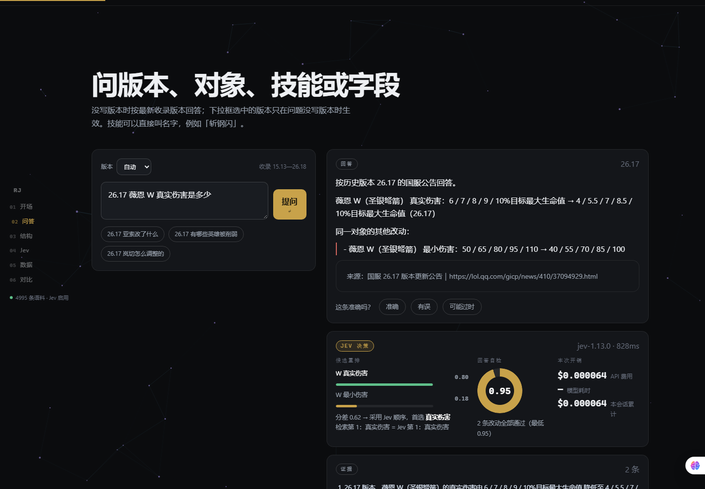
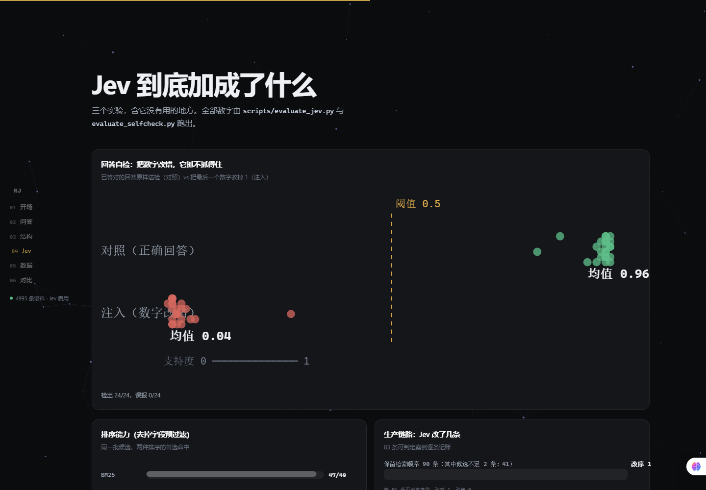
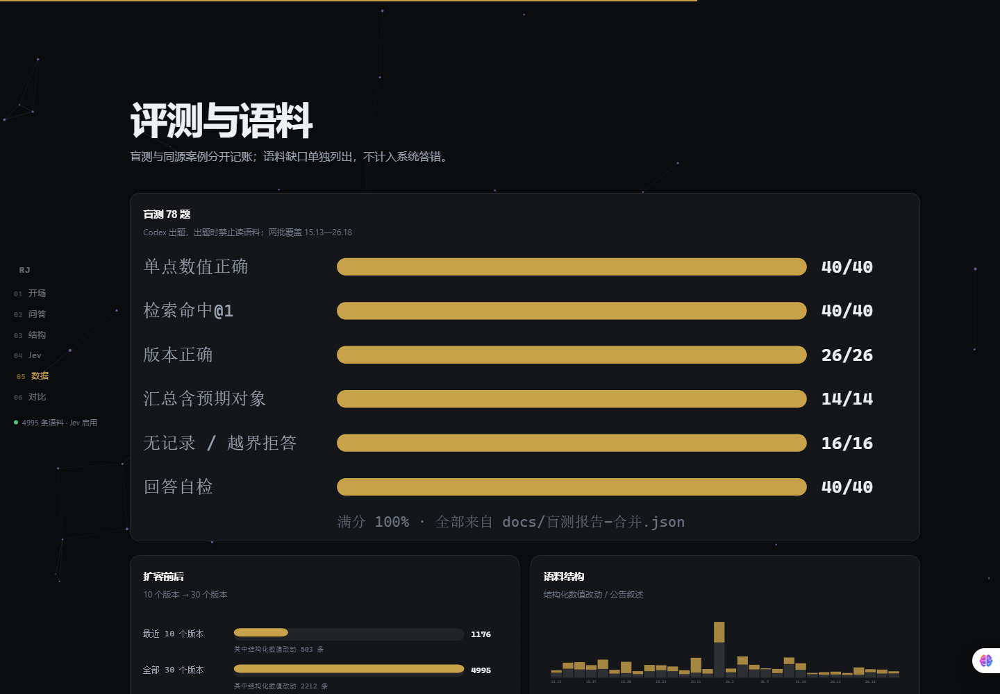

# RAG Jev

[简体中文](README.md) · **[English](README.en.md)**

国服《英雄联盟》版本更新公告的本地 RAG 问答，加上一个 **Jev（TypeSafe System One）决策层**。

[](https://github.com/Nixz0824/rag-jev/actions/workflows/ci.yml)


回答里的数字全部来自官方公告的结构化抽取结果，**不经过生成模型**；Jev 只负责「在候选里选哪一个」这类可校验的判断。

---

## 为什么不是"又一个 RAG demo"

| 维度 | 常见 RAG demo | 本项目 |
|---|---|---|
| 数字来源 | 让模型写数值 | 模板渲染，数值只来自公告 chunk（`_render`） |
| 版本处理 | 纯相似度检索 | **元数据过滤先于排名**；`26.17` / `16.17` / `15.13` 三套版本号自动归一 |
| 评估 | 无，或自己写几条同源问题 | **78 题独立盲测**（出题方被禁止读语料，覆盖 30 个版本）+ 48 条解析盲测 + 18 条陷阱题；同源与盲测分开报，语料缺口单独记账 |
| 负面结论 | 不写 | 三种排序在过滤后打平、门槛测量后不采用、Jev 曾把答案挤到 @2（已加置信闸门）——都留在报告里 |
| 模型定位 | 全流程交给 LLM | 解析用确定性正则（48/48 盲测全过、零延迟）；Jev 只做重排与自检，**$0.0001/次** |
| 拒答 | 靠提示词祈祷 | 关键词黑名单 + 覆盖边界 + 「最近一次改动」回退 + 其它服务器边界，盲测拒答 **16/16** |
| 工程 | 一个 notebook | 98 项单元测试 + GitHub Actions + 进程 Job Object + 索引指纹 + 公告原文不入库 |

---

## 界面

本地单页工作台（`web/`），左侧竖排索引，问答 / 结构 / Jev / 数据 / 对比五段。

**问答**：回答里的数字直接来自公告条目，右边同步显示 Jev 的候选打分、是否采用 Jev 顺序、自检支持度与本次费用。



**Jev 到底加成了什么**：三个实验的图表（自检注入点图、排序能力对照、生产链路记账）。



**评测与语料**：盲测成绩、扩容前后、逐版本语料结构；表格与「Jev 净贡献」清单都读 `docs/*.json`。



支持分享链接：`/?q=26.17 薇恩 W 真实伤害是多少` 打开即提问，`/?view=jev` 直接跳到某个区块。

---

## 一、语料规模

`python scripts/corpus_stats.py` 生成，完整表格见 [docs/语料统计.md](docs/语料统计.md)。

| 指标 | 最近 10 个版本（26.9—26.18） | 全部 30 个版本（15.13—26.18） | 倍数 |
|---|---|---|---|
| 版本数 | 10 | **30** | ×3.0 |
| chunk 总数 | 1176 | **4995** | ×4.25 |
| 结构化数值改动 | 503 | **2212** | ×4.40 |
| 公告叙述段 | 673 | 2783 | ×4.14 |
| 英雄（去重） | 96 | **170** | ×1.77 |
| 装备（去重） | 29 | **85** | ×2.93 |
| 带技能归属的改动 | 265 | **1008** | ×3.80 |

解析质量：结构化占比 44.3%，字段归一率 91.0%（未归一的行保留原文但不参与字段过滤），
带技能归属的结构化改动 1008/2212。逐版本明细与字段分布见统计报告。

---

## 二、评测结果（三套口径分开记账）

全部由 `scripts/evaluate_patch.py` / `evaluate_parse.py` 跑出，页面与报告只读取 `docs/*.json`。

### 盲测 78 题（Codex 依官方公告出题，出题时禁止读语料）

两批盲测覆盖不同版本区间：第一批 38 题（26.9—26.18），第二批 40 题（15.13—26.8，含跨版本聚合题）。

| 指标 | 结果 |
|---|---|
| 单点数值正确 | **40/40** |
| 检索命中@1 / @5 | **40/40 · 40/40** |
| 版本正确（26 条写了版本的题） | **26/26** |
| 汇总含预期对象 | **14/14** |
| 跨版本聚合时间线覆盖 | **6/6** |
| 无记录 / 越界拒答 | **16/16** |
| Jev 回答自检（支持度 ≥ 0.5） | **40/40** |

第二批盲测抓到 3 个系统性缺陷（都已修复，见下方「盲测抓到的问题」），另有 **2 条语料缺口**单独记账：

- 15.16 格温基础护甲：国服该版本公告里没有这条改动（英文公告有），属于两边公告内容差异；
- 26.6 希瓦娜大型更新：重做类章节用描述性文字给出新数值（不是 `旧值 ⇒ 新值`），结构化解析按设计不收录。

### 同源 84 例（作者按语料编写，**非盲测**，用于回归）

| 指标 | bm25 | vector | hybrid | hybrid + Jev |
|---|---|---|---|---|
| 单点命中@1（28 条） | 25 | 25 | 26 | 26 |
| 定点命中@1（23 条，候选歧义） | 21 | 22 | 21 | **22** |
| 汇总含预期对象（4 条） | 4 | 4 | 4 | 4 |
| **跨版本聚合（4 条，多跳）** | 4 | 4 | 4 | 4 |
| 无记录/越界拒答（7 条） | 7 | 7 | 7 | 7 |
| 陷阱题（18 条，规则定义） | 18 | 18 | 18 | 18 |
| 回答自检 | — | — | — | **55/55** |
| Jev 开销 | — | — | — | $0.0031 / 37 次 |

### 查询理解盲测 48 条（期望只看解析结果）

**48/48**：主体 37/37、版本 10/10、技能 14/14、字段 19/19、模式 3/3、意图与守卫 9/9。

---

## 三、Jev 到底加成了什么（三个可复现实验）

不是"接了模型所以更强"，而是把 Jev 的三个作用分别测出来，含它**没有**用的地方。

### 实验 1 · 排序能力：去掉字段预过滤，同一批候选比首选

生产链路先用元数据过滤把候选压到 1—6 条，Jev 几乎没得选。所以专门做一组对照：
候选集取「该对象在该版本的全部改动行」（≥2 条才计入，共 49 条案例），同一批候选下比首选命中。

| 口径 | 首选命中 |
|---|---|
| BM25（元数据过滤后） | 47/49 |
| **Jev 重排（同一批候选）** | **48/49** |

Jev 独对 1 条、BM25 独对 0 条。命令：`python scripts/evaluate_jev.py --ranker`

### 实验 2 · 回答自检：注入错误数字，看它抓不抓得住

把已经答对的回答原样送进自检（对照组），再把渲染行里**最后一个数字改掉 1**（注入组），同一个 `jev.judge_many` 判定：

| 组 | 支持度（均值） | 判定不合格 |
|---|---|---|
| 对照（正确回答） | **0.96** | 0/24（无误报） |
| 注入（数字改错） | **0.04** | **24/24（全检出）** |

两次调用合计 $0.00045。命令：`python scripts/evaluate_selfcheck.py`

### 实验 3 · 生产链路逐条记账：Jev 到底改了几条

91 条可判定案例（两批盲测 + 同源定点）：

| 情况 | 条数 |
|---|---|
| 过滤后候选不足 2 条，Jev 无法介入 | 41 |
| Jev 改序 | **1**（改对 1、改错 0） |
| Jev 保留顺序 | 90（其中第 1 条本来就对 87、本来就错 3） |

命令：`python scripts/evaluate_jev.py`　报告：[docs/Jev效果.md](docs/Jev效果.md)

### 结论

- **值**：候选歧义或问法与标签不一致时，Jev 能把正确行捞回来；回答自检是唯一能对"数字是否被证据支持"做出判定的环节（注入检出 24/24、误报 0）。
- **不值**：元数据过滤已经把检索变简单，重排空间很小（91 条里只改 1 条）；解析层完全不需要它。
- **成本**：$0.0001/次、约 1.2s；无 key 时自动降级并在轨迹里标注。

## 盲测抓到的问题（都已修复）

| # | 问题 | 怎么发现 | 修复 |
|---|---|---|---|
| 1 | 方向判定只看第一个数：`30-60% → 30-50%` 被判成「调整」而不是削弱 | 盲测聚合题「锐雯历次被削弱是哪些版本」 | 逐个数对比 + 混合取和；`adjust` 从约 700 条降到 81 条 |
| 2 | 区间连字符被当成负号：`30-60%` 解析出 `[30, -60]` | 同上 | 数字正则加前置断言，连字符不再当作符号 |
| 3 | 技能写在字段名里（`R 被动过载涌动伤害`）时技能归属丢失 | 盲测单点题「瑞兹 R 被动过载涌动伤害」 | 解析时从字段名前缀提取 Q/W/E/R |
| 4 | 短别名压过主体名：提问「瑞兹 R 被动过载涌动伤害」被解析成物品「过载」 | 同上 | 别名匹配改为「最长优先 → 位置靠前优先 → 英雄优先于装备」 |
| 5 | 俗称缺失（船长/鸟皇/熊/猴子/诺手/铁男/冰女等） | 盲测单点题「船长 Q 蓝耗」「鸟皇基础生命值」 | 英雄俗称补到 100+ 条、装备规则 74 条（含 IE/BT/QSS/PD 等英文缩写） |

---

## 快速开始

```powershell
# 1. 依赖：Python 3.12+ 与 numpy
python -m pip install numpy

# 2. 模型（约 1.7 GB，脚本按 SHA-256 校验）
python scripts/download_runtime.py
python scripts/download_models.py

# 3. 语料（需要联网：Data Dragon + 国服公告）
python scripts/build_aliases.py
python scripts/ingest_qq.py --count 30 --pages 90   # 想快就 --count 10

# 4. 启动（首次会构建向量索引）
python launch.py
# 浏览器打开 http://127.0.0.1:18890
```

停止：`python launch.py --stop`，或运行 `停止服务.cmd`。

### Jev（可选）

```powershell
$env:TYPESAFE_API_KEY = "sk-..."   # 或写入 runtime/jev-key.txt
```

没有 key 时系统照常工作，只是不做重排与自检（`/api/health` 会显示 `jev.enabled=false`）。

---

## 能问什么

| 问法 | 行为 |
|---|---|
| `26.17 亚索改了什么` | 该版本该英雄的全部结构化改动 |
| `16.17 岚切怎么调整的` | Data Dragon 版号自动换算到公告版号 26.17 |
| `15.13 希瓦娜 W 冷却` | 2025 赛季两套版本号（15.x / 25.x）都能落到正确版本 |
| `26.17 薇恩 W 真实伤害是多少` | 先按字段过滤，再由 Jev 选出最匹配的一条 |
| `26.17 有哪些英雄被削弱` | 该版本改动清单（默认只看召唤师峡谷） |
| `赛娜从 26.13 到 26.18 一共改了几次` | **跨版本聚合**：逐版本时间线 + 方向统计 + 最常被改的字段，并说明其它模式被略过多少条 |
| `沃利贝尔历次被削弱的记录` | 不带版本范围时按全部收录版本聚合，可再按方向收窄 |
| `娜美 E 每次伤害改成多少了` | 未写版本且最新版没有 → 回退到**最近一次改动**并标注历史版本 |
| `26.15 锐雯的放逐之锋怎么改了` | **按技能名提问**（865 条技能名映射到 Q/W/E/R/被动） |
| `电刀现在多少钱` / `IE 多少钱` | **装备俗称与英文缩写**（电刀=斯塔缇克电刃，IE=无尽之刃） |
| `卢登的配枪改了什么` / `C44 改了什么` | 公告里的**历史名与内部代号**（已改名或 Data Dragon 未收录）也能命中 |
| `26.17 亚索为什么被调整` | 附上公告里的设计说明（叙述语料） |
| `26.16 迦娜这版改了什么` | 公告只有说明文字、没有数值条目时，明确说「不给数值」，而不是把说明当改动 |
| `26.6 希瓦娜重做了什么` | 重做/大型更新是描述性文字，如实说明不收录 |
| `26.18 阿卡丽改了什么` | 该版本没有记录时，提示其它版本里有记录 |

---

## 命令

```powershell
python -m unittest discover -s tests          # 98 项，不需要模型与网络
python scripts/ingest_qq.py --offline         # 用已缓存公告重建语料
python scripts/corpus_stats.py                # 语料统计表（docs/语料统计.md）
python scripts/build_aliases.py --offline     # 重建英雄/装备别名表
python scripts/evaluate_parse.py              # 查询理解盲测（不需要模型）
python scripts/evaluate_patch.py              # 四口径 A/B（需模型在跑；Jev 需要 key）
python scripts/calibrate.py --report          # 门槛测量（结论：不采用）
python scripts/ingest_en.py --offline         # 与英文公告对照核验
python scripts/review_feedback.py             # 复核页面反馈，产出 docs/反馈复核.md
python tools/screenshot.py                    # 用 CDP 截界面图（需 Edge + 服务在跑）
# 盲测（先按 docs/盲测集提示词.md 与 提示词-第二批.md 出题）：
python scripts/evaluate_patch.py --cases tests\cases\blind_cases.json --out docs\盲测报告-第一批.md
python scripts/evaluate_patch.py --cases tests\cases\blind_cases_2.json --out docs\盲测报告-第二批.md
# 两批合并（78 题）：
python scripts/evaluate_patch.py --cases "tests\cases\blind_cases.json,tests\cases\blind_cases_2.json" --out docs\盲测报告-合并.md
```

---

## 数据边界（请按此引用本项目）

- 主语料是**国服官方公告正文**，覆盖英雄、装备与系统数值改动；皮肤、炫彩、云顶、模式机制不在抽取范围。
- 公告里没有写的**版本内热修**不在语料中，系统会明确提示而不是猜。
- 公告只记录改动，因此「最近一次调整」**不等于**「当前实际数值」。
- 国服公告数值与其它服务器可能不同，本项目以国服为准，不做跨服务器断言。
- 解析可能漏项：`docs/解析覆盖率.md` 记录每个版本的解析量与未识别字段。

## 版权

公告原文只保存在本地 `data/patch/`（已被 `.gitignore` 排除），仓库里只有抓取解析脚本、统计与少量测试样例。
数据来源与许可见 [THIRD_PARTY_NOTICES.md](THIRD_PARTY_NOTICES.md)。

## 目录

```
config.py           端口与路径的单一来源
engine.py           BM25 + 向量 + RRF 检索内核与门槛
patch_engine.py     版本解析、元数据过滤、答案渲染、Jev 接入点
patch_schema.py     字段键、箭头/技能行解析、句子的唯一定义处
jev.py              TypeSafe System One 客户端（重排 / 分类 / 自检）
server.py           本地 HTTP API 与静态页面
launch.py           三进程监督（Windows Job Object，退出即回收）
scripts/            ingest_qq / build_aliases / corpus_stats / evaluate_* / calibrate / ingest_en / review_feedback
tests/              98 项单元测试 + 手写样例语料 + 盲测集
web/                单页工作台（问答 / 结构 / 数据 / 版本对比）
docs/               评测报告、盲测报告、语料统计、门槛校准、对照核验、交接文档
```
